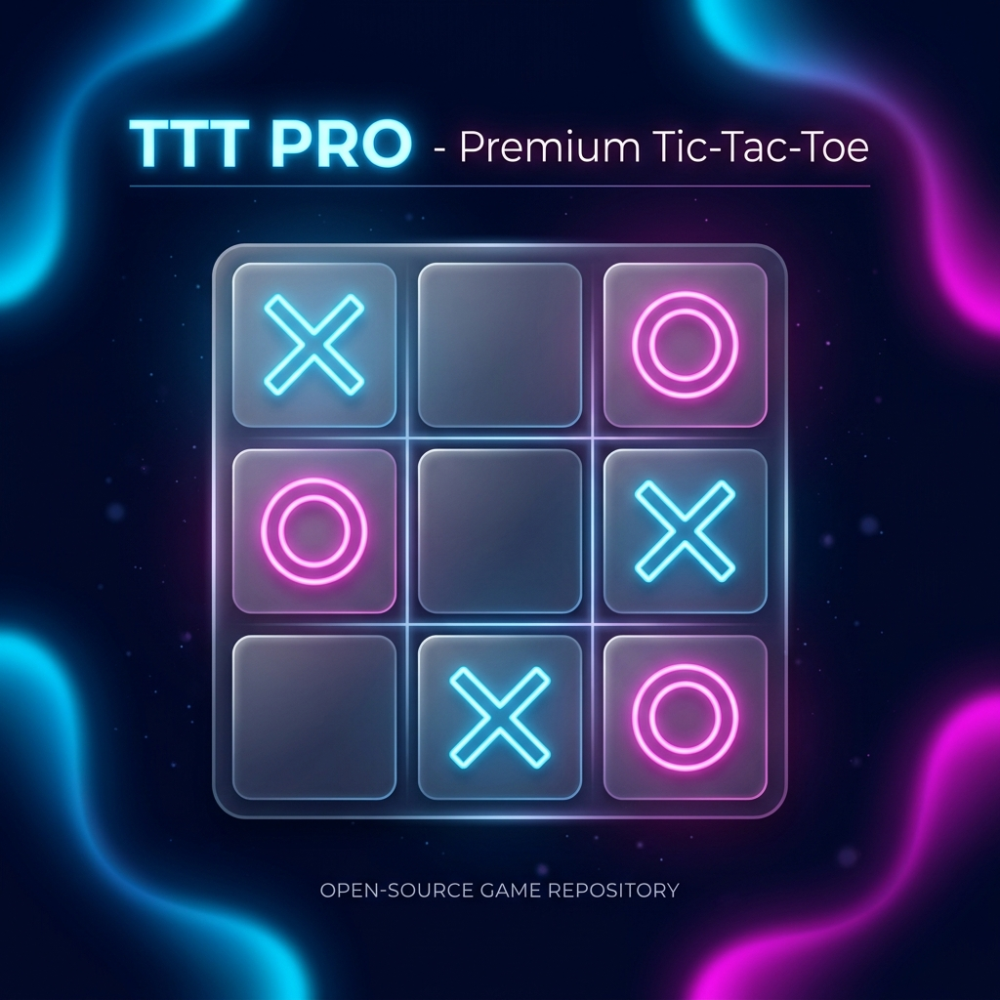
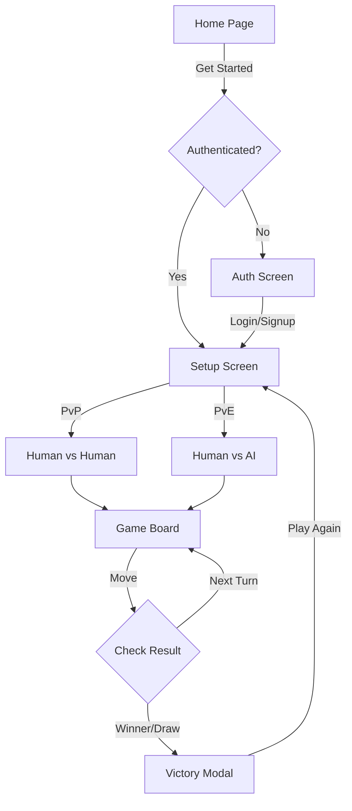

<div align="center">
  
  
  # 🚀 TTT PRO: Premium Tic-Tac-Toe
  
  [](https://opensource.org/licenses/MIT)
  []()
  []()
  
  **Experience the next evolution of Tic-Tac-Toe. Minimalist, Modern, and Masterfully crafted.**
  
  [Play Now](index.html) • [Report Bug](https://github.com/algorithnicmind/tic-toe-game/issues) • [Request Feature](https://github.com/algorithnicmind/tic-toe-game/issues)
</div>

---

## ✨ Features

- **💎 Premium Glassmorphism**: A stunning UI built with backdrop filters and vibrant animations.
- **🤖 Smart AI (Minimax)**: Challenge an unbeatable algorithm that never makes a mistake.
- **👥 Local Multiplayer**: Competitive play with custom player names and score tracking.
- **🔒 Integrated Auth**: Secure-looking mock authentication for a professional user experience.
- **📱 Fully Responsive**: Seamlessly play on any device, from desktop to mobile.

---

## 🎮 Game Flow

Below is the architectural flow of the application, from landing to the final victory.



---

## 🛠️ Tech Stack

- **HTML5**: Semantic structure.
- **CSS3**: Modern layouts with Flexbox/Grid and Glassmorphism.
- **JavaScript**: Pure Vanilla JS for game logic and SPA navigation.
- **Mermaid**: Professional diagrams and flowcharts.

---

## 🚀 Getting Started

### Prerequisites
- Any modern web browser (Chrome, Firefox, Safari, Edge).

### Installation
1. Clone the repository:
   ```bash
   git clone https://github.com/algorithnicmind/tic-toe-game.git
   ```
2. Navigate to the project directory:
   ```bash
   cd tic-toe-game
   ```
3. Open `index.html` in your browser.

---

## 📸 Screenshots

<div align="center">
  
  <p><i>Modern Glassmorphic Interface</i></p>
</div>

---

## 🤝 Contributing

Contributions are what make the open-source community such an amazing place to learn, inspire, and create. Any contributions you make are **greatly appreciated**.

1. Fork the Project
2. Create your Feature Branch (`git checkout -b feature/AmazingFeature`)
3. Commit your Changes (`git commit -m 'Add some AmazingFeature'`)
4. Push to the Branch (`git push origin feature/AmazingFeature`)
5. Open a Pull Request

---

<div align="center">
  <p>Built with ❤️ by <b>Antigravity AI</b></p>
</div>